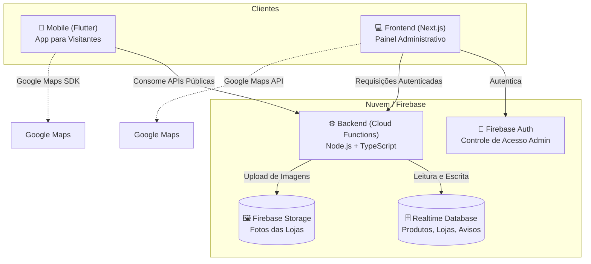

# ⛩️ Kibō-no-Iê — Sistema de Gestão e Guia de Eventos

> Solução completa e integrada desenvolvida para o ecossistema de eventos e atendimento da **Sociedade Beneficente Kibô-no-Iê**, composta por aplicativo mobile para visitantes, painel administrativo web para a organização e backend serverless em nuvem.

---

## 📌 Visão Geral da Arquitetura

O projeto é dividido em três frentes complementares que se comunicam através da infraestrutura do Firebase:



---

## 📂 Estrutura do Repositório

```text
kibo-no-ie/
├── backend/      # Firebase Cloud Functions (API REST Serverless em TypeScript)
├── frontend/     # Painel de administração Web (Next.js 16 + React 19 + TailwindCSS)
├── mobile/       # Aplicativo para visitantes (Flutter + Dart)
├── firebase.json # Configuração de deploy do ecossistema Firebase (Hosting & Functions)
└── LICENSE       # Licença do projeto (Apache 2.0)
```

---

## ⚙️ 1. Backend (`/backend`)

O backend consiste em uma arquitetura serverless orientada a funções (**Cloud Functions for Firebase**) que fornece os endpoints REST para todo o ecossistema.

### 🎯 O que faz
* **Gerenciamento de Produtos**: Cadastro, listagem e atualização de itens disponíveis para venda (preços, categorias e disponibilidade em estoque).
* **Gerenciamento de Lojas/Barracas**: Registro e atualização de pontos do evento com coordenadas geográficas (latitude/longitude) e fotos.
* **Quadro de Avisos**: Publicação e recuperação de comunicados e avisos oficiais em ordem cronológica decrescente.
* **Processamento de Imagens**: Recebe fotos de lojas codificadas em Base64, decodifica para buffer, persiste no **Firebase Storage** e gera URLs públicas.
* **Segurança e Autenticação**: Valida tokens JWT administrativos para proteger endpoints de escrita e alteração (operações `POST` e `PATCH`).

### 🛠️ Como faz (Tecnologias & Implementação)
* **Linguagem & Runtime**: Node.js 24 com TypeScript.
* **Framework Serverless**: `firebase-functions` (v7) com instâncias gerenciadas e suporte a CORS habilitado.
* **Banco de Dados**: `firebase-admin/database` (**Firebase Realtime Database**) para leituras rápidas e estruturadas em nós (`/products`, `/shops`, `/warnings`).
* **Storage**: `firebase-admin/storage` para gravação de arquivos com extensão dinâmica e ACL pública.
* **Autenticação**: Helper `validateAuth` que valida o cabeçalho `Authorization: Bearer <idToken>` através do `firebase-admin/auth` (`verifyIdToken`).

#### 🔌 Endpoints Disponíveis

| Endpoint | Método | Auth | Descrição |
| :--- | :--- | :---: | :--- |
| `listProducts` | `GET` | Não | Retorna a lista de produtos cadastrados com categoria, preço e status de disponibilidade. |
| `createProduct` | `POST` | Sim | Adiciona um novo produto ao catálogo. |
| `updateProduct` | `POST`/`PATCH` | Sim | Atualiza dados de um produto existente (preço, nome, categoria, disponibilidade). |
| `listShop` | `GET` | Não | Retorna as lojas/pontos cadastrados com suas localizações e URLs de imagem. |
| `createShop` | `POST` | Sim | Cadastra uma nova loja, realizando o upload da imagem em Base64 para o Storage. |
| `updateShop` | `POST`/`PATCH` | Sim | Atualiza os dados de uma loja e substitui sua foto se fornecida. |
| `listWarning` | `GET` | Não | Retorna todos os avisos em ordem decrescente de timestamp. |
| `createWarning` | `POST` | Sim | Cria um novo comunicado público com timestamp automático. |

### 🚀 Como Executar e Fazer Deploy

```bash
# Navegar até o diretório
cd backend

# Instalar dependências
npm install

# Compilar TypeScript
npm run build

# Executar localmente com os Emuladores do Firebase
npm run serve

# Fazer deploy das funções para a nuvem
firebase deploy --only functions
```

---

## 💻 2. Frontend Web (`/frontend`)

Painel administrativo responsivo voltado para a equipe de coordenação e voluntários do evento.

### 🎯 O que faz
* **Painel de Autenticação**: Tela de login restrita via Firebase Authentication para acesso ao gerenciamento.
* **Gestão do Catálogo de Produtos**: Interface com agrupamento visual por categorias, indicação de disponibilidade (em estoque / esgotado), alteração rápida de preços e criação de novos itens via modal.
* **Gestão de Lojas e Pontos**: Listagem e edição de barracas, permitindo alterar nome, coordenadas geográficas e realizar upload de novas fotos com pré-visualização.
* **Visualização Geral do Mapa**: Mapa integrado para checagem visual das coordenadas de cada loja e pop-up informativo de cada marcador.

### 🛠️ Como faz (Tecnologias & Implementação)
* **Framework**: Next.js 16 (App Router) e React 19.
* **Estilização**: TailwindCSS v4 com design limpo, tipografia moderna e cards interativos.
* **Mapas**: `@react-google-maps/api` para renderização do mapa interativo, marcadores (`MarkerF`) e balões de informações (`InfoWindowF`).
* **Context API**: `AuthContext` para observação de estado de autenticação (`onAuthStateChanged`) e proteção de rotas privadas no client-side.
* **Custom Hooks**: Hooks dedicados (`useProducts`, `useShops`) para consumo dos endpoints do backend e revalidação de dados (`refetch`).

### 🚀 Como Executar e Fazer Deploy

```bash
# Navegar até o diretório
cd frontend

# Instalar dependências
npm install

# Configurar variáveis de ambiente (.env)
# NEXT_PUBLIC_GOOGLE_MAPS_API_KEY=sua_chave_aqui
# Configurações do Firebase SDK (apiKey, authDomain, etc.)

# Iniciar em ambiente de desenvolvimento
npm run dev

# Gerar build de produção
npm run build

# Fazer deploy no Firebase Hosting
firebase deploy --only hosting
```

---

## 📱 3. Mobile (`/mobile`)

Aplicativo móvel multiplataforma projetado para uso pelos participantes e visitantes durante os eventos.

### 🎯 O que faz
* 🗺️ **Mapa Interativo do Local**: Exibe a planta do evento em visão de satélite, com marcadores clicáveis que abrem detalhes e fotos de cada loja/barraca.
* 🍱 **Comidas & Bebidas (Cardápio Interativo)**:
  * Catálogo completo separado por categorias (`ChoiceChips`).
  * Controle de quantidade de itens (`+` / `-`).
  * Calculador de total em tempo real com indicador visual (**"Pedir no caixa: R$ X,XX"**), facilitando o fechamento do pedido e agilizando as filas.
* 📢 **Quadro de Avisos**: Feed de comunicados oficiais e recados importantes em tempo real para os visitantes.

### 🛠️ Como faz (Tecnologias & Implementação)
* **Framework**: Flutter (Dart) com suporte a **Android** e **iOS**.
* **Design de Interface**: Utiliza `MaterialApp` no Android e adaptação nativa para `CupertinoApp` no iOS, com `Scaffold` e `NavigationBar` inferior para transição entre as 3 telas principais.
* **Mapas**: `google_maps_flutter` configurado com `MapType.satellite`, controle de gestos, câmera focada no local do evento e marcadores dinâmicos.
* **Rede & Parsing**: Pacote `http` para consumo assíncrono dos endpoints do backend e serialização com models tipados (`Product`, `Shop`, `Warning`).
* **Gerenciamento de Estado**: `StatefulWidget` combinado com `FutureBuilder` para carregamento assíncrono, feedback visual com spinners e tratamento de erros.

### 🚀 Como Executar

```bash
# Navegar até o diretório
cd mobile

# Obter dependências do Flutter
flutter pub get

# Listar emuladores/dispositivos disponíveis
flutter emulators

# Iniciar emulador desejado
flutter emulators --launch <emulator_id>

# Executar o app no dispositivo/emulador conectado
flutter run
```

---

## 🔐 Configuração e Variáveis de Ambiente

Para rodar todo o ecossistema localmente, certifique-se de configurar:

1. **Firebase CLI**:
   ```bash
   npm install -g firebase-tools
   firebase login
   firebase use <id-do-projeto>
   ```
2. **Google Maps API Key**:
   * Habilitar Maps JavaScript API (para o Frontend Web).
   * Habilitar Maps SDK for Android e Maps SDK for iOS (para o Mobile).

---

## 📄 Licença

Este projeto está sob a licença [Apache 2.0](LICENSE).
